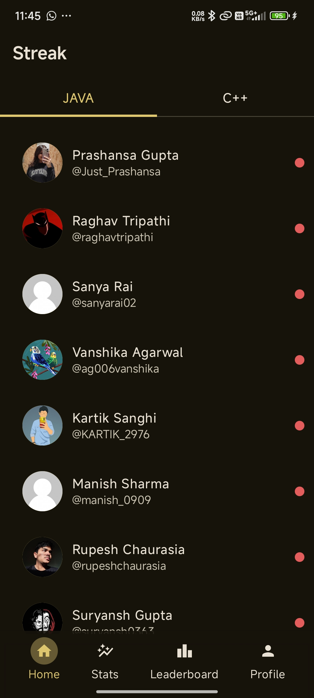
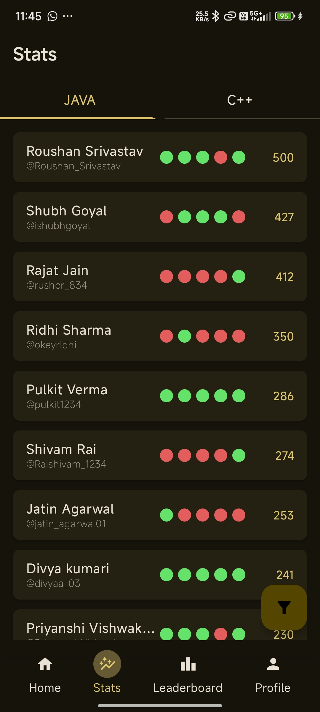
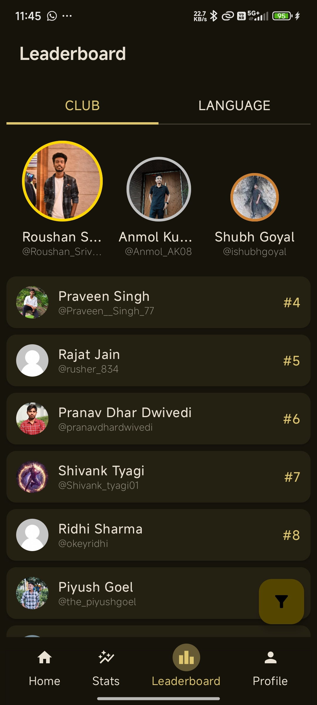
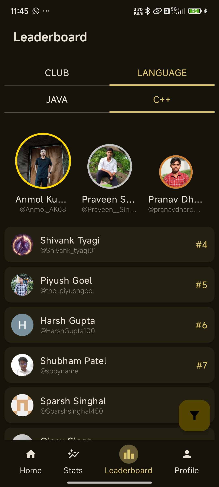
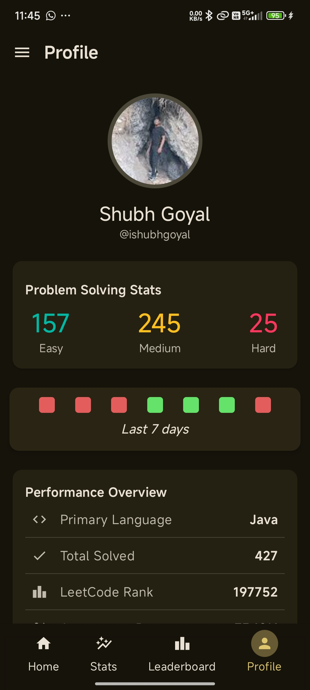
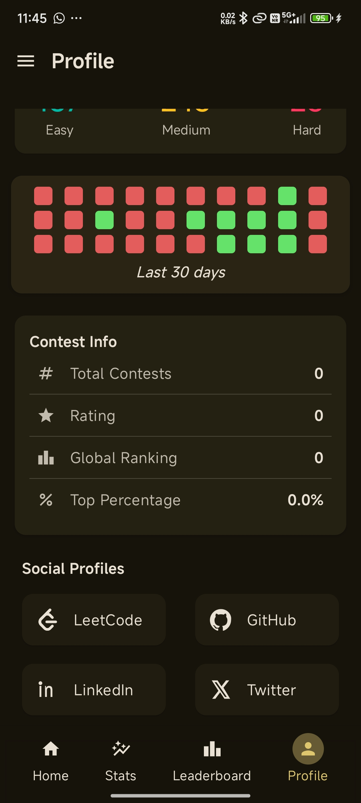

# 📈 LeetCode Tracker App

A full-stack mobile application to track and visualize LeetCode stats, contests, streaks, and user profiles. It includes JWT-based authentication, leaderboard, editable user data, and more!

  

  
  
  

 

  
  
  

---

## 🛠️ Tech Stack

### ⚙ Backend (Spring Boot)
- Java 17
- Spring Security + JWT
- Spring Data JPA
- PostgreSQL
- Maven

### 📱 Frontend (Android)
- Kotlin + Jetpack Compose
- Hilt for DI
- Retrofit for Networking
- MVVM Architecture
- Shared Preferences

---

## ✨ Features

### 🧠 Core
- Sign Up / Login with JWT authentication
- View your LeetCode stats, contests, and streak
- Edit your profile and change password
- See others' profiles and leaderboard

### 📊 Visuals
- Graphs and charts to track progress (via stats screen)
- Light and responsive UI with Compose

### 🔒 Security
- JWT-based login
- Secure backend routes

---

## 🧳 Project Structure

 
├── backend/ # Spring Boot backend (API + DB + Security)
    
└── frontend/ # Android app using Jetpack Compose

